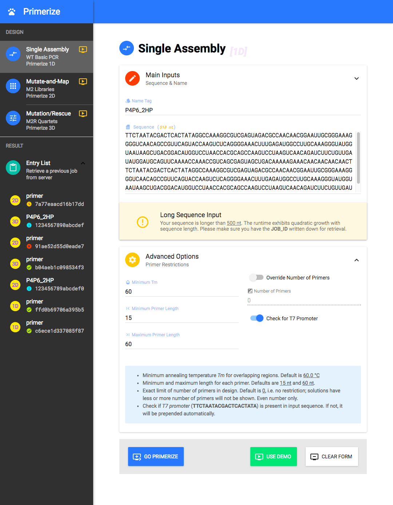

# t47io Primerize Demo

Primerize front-end implemented with `React`, `Redux`, `Webpack`, `Babel`, and `Material UI`.

### *Under active development*

## Preview

## License

**Copyright &copy; 2016: Siqi Tian. All Rights Reserved.**

Code and content are licensed under [**CC-BY-NC-SA 4.0**](https://creativecommons.org/licenses/by-nc-sa/4.0/).

by [**t47**](https://t47.io/), *October 2016*.
